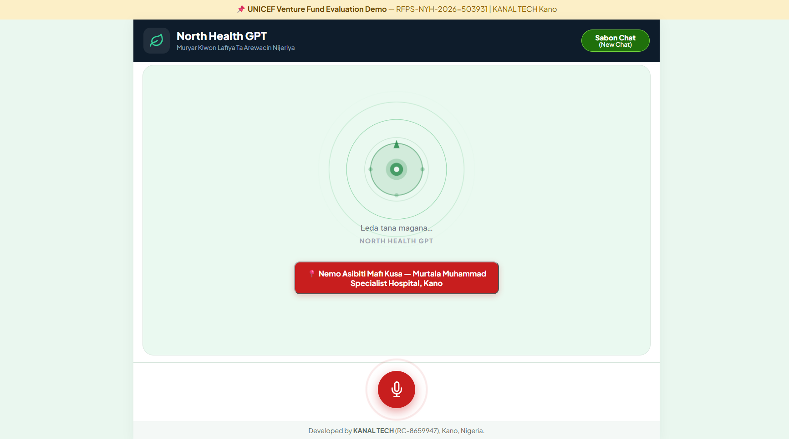
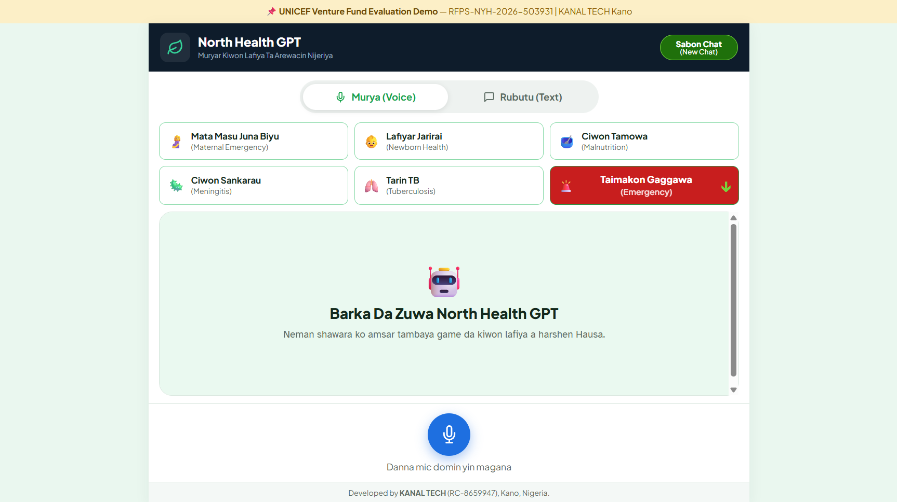

# 🏥 North Health GPT

> **Hausa-language, voice-first AI system for early health danger-sign recognition, health guidance and facility referral for underserved communities in Northern Nigeria.**

[](LICENSE)
[](LICENSE)
[](https://www.unicefventurefund.org/)
[](https://www.kanaltech.site/)
[](#current-status)
[](#language-and-localisation)

**Developer:** Gaddafi Badamasi · KANAL TECH (RC-8659947) · Kano, Nigeria  
**RFPS Reference:** RFPS-NYH-2026-503931 — UNICEF Innovation Fund, Climate Ventures 2026  
**Live Demo:** https://www.kanaltech.site/  
**Pitch Video:** https://youtube.com/shorts/26FnScv_VhI

---

## 1.1 UNICEF Venture Fund Alignment and Open-Source Position

North Health GPT is being developed for an early-stage, open-source frontier-technology funding context. The UNICEF Venture Fund currently describes its early-stage funding as up to **US$100,000 in equity-free funding** for open-source frontier technology solutions showing promising results. Its published eligibility criteria include an existing prototype with promising initial results, registration in a UNICEF programme country, potential positive impact for vulnerable children, measurable real-time data, and an open-source frontier-technology solution.

Official references:
- UNICEF Venture Fund — Funding & Support: https://www.unicefventurefund.org/funding-support
- UNICEF Venture Fund — Apply for Funding / eligibility: https://www.unicefventurefund.org/apply-funding
- UNICEF Venture Fund — Climate Resilience and Health call: https://www.unicefventurefund.org/call/funding-frontier-climate-tech-childrens-health

### Use of proprietary AI services

The current prototype uses Google Gemini services for real-time voice and text capabilities. This does **not** mean that North Health GPT is claiming ownership of or fine-tuning the Gemini foundation models. The repository's own software, health-logic architecture, referral schema, interface, integration code, evaluation tooling and future Hausa speech components are developed as separable project assets.

UNICEF's published FAQ states that a funded solution must be Open Source, while not requiring every technology used by the company to be Open Source; it also states that the funded solution must be placed under an Open Source license by month six of the investment period. UNICEF further notes that end-to-end Open Source solutions may receive priority. North Health GPT therefore treats **provider independence and Open Source readiness as architecture requirements**, not as claims that a proprietary API itself is Open Source.

The repository deliberately documents this distinction so a technical evaluator can see exactly what exists today, what is provided by a third-party API, and what North Health GPT intends to build and validate during the investment period.

---

## 1.2 Prototype Screenshots

The screenshots below document the current evaluation interface. They are included as visual evidence of the working prototype and are not mockups of a future product.

### 1 — Voice-first opening state



The first screen shows the voice-first North Health GPT interaction state, including the Hausa identity, Leda voice status and emergency referral presentation.

### 2 — Main interaction and health-area selection



The second screen shows the Voice/Text mode selector, the five primary health areas, the emergency pathway and the Hausa interaction surface.

These screenshots are intentionally kept in the repository so reviewers can inspect the prototype presentation alongside the source code.

---

## 1. Executive Summary

North Health GPT is an early-stage **voice-first digital health technology** being developed specifically for Hausa-speaking communities in Northern Nigeria.

The project addresses a fundamental accessibility problem: evidence-based health information may exist, but it is not equally usable by people who have limited literacy, communicate primarily in Hausa, use low-cost devices, or live in locations where connectivity and access to health professionals are unreliable.

North Health GPT is designed to make health guidance accessible through **natural Hausa voice interaction**, particularly for women of reproductive age, mothers and caregivers of young children, and community health workers.

The intended interaction is simple:

1. The user describes a health concern in natural Hausa.
2. The system interprets the conversation and relevant symptoms.
3. A structured health pathway evaluates relevant danger signs and urgency.
4. The system communicates understandable guidance in Hausa.
5. Where appropriate, the system recommends timely professional care and an appropriate referral facility.

The current repository contains the **working web prototype and the technical documentation supporting the proposed development architecture**. The prototype is not presented as the completed 12-month system.

The next development stage is intended to transform the prototype into a clinically reviewed, Hausa-native, increasingly offline-capable platform through development and validation of:

- dedicated Hausa automatic speech recognition (ASR);
- dedicated Hausa text-to-speech (TTS);
- structured WHO/IMCI-aligned health logic;
- condition-specific danger-sign pathways;
- a ground-truthed referral database;
- an offline-capable Android application;
- community-health-worker workflows;
- privacy-preserving monitoring and evaluation; and
- open-source technical assets where licensing, privacy and safety permit.

The long-term objective is **not to create a generic chatbot translated into Hausa**. It is to build health technology around the language, connectivity, literacy, clinical and community realities of Northern Nigeria.

---

## 2. The Problem

Northern Nigeria carries a substantial burden of preventable maternal, newborn and child health problems. The project's RFPS submission identifies delayed recognition of danger signs and delayed action as a critical addressable failure.

The problem is not simply the absence of medical knowledge. WHO and other health institutions already publish extensive clinical guidance. The problem is the gap between:

**available knowledge → understandable communication → recognition of danger → appropriate referral → timely care.**

For many Hausa-speaking communities, especially people with limited formal education, health information can remain difficult to use because it is frequently delivered through:

- English-language resources;
- written instructions;
- formal medical terminology;
- health workers who may not be immediately available;
- applications that assume strong digital literacy; and
- online services that assume reliable connectivity.

A person may recognise that a child, newborn or pregnant woman is seriously unwell without knowing which signs are dangerous, how urgently care is needed, or which facility is appropriate.

Language and interaction format therefore become health-access issues.

---

## 3. Climate and Health Context

Northern Nigeria is part of a climate-vulnerable region where environmental and socioeconomic shocks can interact with existing health risks.

Relevant factors include:

- Harmattan and dust conditions;
- seasonal disease patterns;
- drought and food insecurity;
- flooding;
- displacement;
- disruption of transport and infrastructure; and
- interruption of access to health services.

North Health GPT is designed to incorporate a **climate-health perspective** into its health-information and resilience architecture.

The project specifically proposes climate-responsive attention to:

- meningitis risk during the relevant Harmattan/meningitis season;
- seasonal severe acute malnutrition risk during lean periods; and
- continuity of health guidance and referral support during climate-related connectivity or infrastructure disruption.

Climate context is not intended to diagnose disease. It provides contextual information that can influence education, screening and prioritisation while clinical safety rules remain primary.

---

## 4. The Solution

North Health GPT is a **voice-first, Hausa-language AI health guidance and referral system**.

The intended user experience is deliberately simple:

```text
SPEAK
  ↓
UNDERSTAND
  ↓
ASSESS RELEVANT DANGER SIGNS
  ↓
PROVIDE SAFE GUIDANCE
  ↓
REFER WHEN NECESSARY
```

A future user should not need to understand medical terminology or communicate in English to begin an interaction.

The system is designed to understand ordinary Hausa conversation, identify information relevant to a structured health pathway, communicate in clear Hausa, and help the user act appropriately when professional care is required.

The proposed full system is designed for:

- low-cost Android devices;
- low-literacy users;
- intermittent connectivity;
- community health-worker use; and
- gradual movement of suitable capabilities toward local/offline execution.

The **current prototype is web-based and uses external AI infrastructure for real-time voice and text interaction**. It is therefore important to distinguish today's prototype from the planned dedicated Hausa and offline components described in the roadmap.

---

## 5. Five Initial Health Areas

The RFPS defines five target conditions/health areas:

| Hausa / Local Concept | English | Primary Objective |
|---|---|---|
| 🤱 **Mata Masu Juna Biyu** | Maternal Emergencies | Recognise important maternal danger signs and support timely referral |
| 👶 **Lafiyar Jarirai** | Newborn Danger Signs | Recognise newborn warning signs requiring professional assessment |
| 🧠 **Ciwon Sankarau** | Meningococcal Meningitis | Recognise potentially serious meningitis presentations and support urgent referral |
| ⚖️ **Ciwon Tamowa** | Severe Acute Malnutrition (SAM) | Support recognition and referral for children who may require nutrition/medical care |
| 🫁 **Tarin TB / Tarin Ciwon Huhu** | Tuberculosis | Support recognition of concerning TB-related presentations and appropriate referral/testing pathways |

Each health area is intended to have its own structured pathway, danger-sign criteria, escalation rules and referral requirements.

The repository's referral schema explicitly models the five condition categories as:

`MATERNAL | NEWBORN | MENINGITIS | SAM | TB`

The health-logic architecture is designed to align with the clinical frameworks identified in the submitted RFPS documentation, including WHO and WHO-UNICEF IMCI guidance.

---

## 6. Health Guidance Is Not Autonomous Diagnosis

North Health GPT is designed as a **health guidance and referral technology**, not as a replacement for a doctor, nurse, midwife, community health worker or other qualified professional.

The system's role is to:

- improve access to understandable health information;
- recognise potentially important danger signs;
- support appropriate urgency decisions;
- encourage timely professional care; and
- help identify an appropriate referral pathway.

It should not claim clinical certainty where uncertainty exists.

Where serious danger signs are identified, the safety architecture prioritises urgent professional assessment.

Where information is incomplete or uncertainty remains, the system is designed to favour the safer escalation/referral pathway rather than provide false reassurance.

---

## 7. Current Prototype vs. Long-Term North Health GPT Platform

Transparency about implementation status is a core principle of this repository.

### Currently demonstrated in the prototype

- Working North Health GPT web interface
- Voice interaction using Gemini Live infrastructure
- Text-based health interaction using configured Gemini API infrastructure
- Hausa-focused conversational behaviour
- Health guidance workflows
- Five-condition health-logic design
- Emergency and condition-specific interaction flows
- Referral-oriented interaction design
- Server-side API credential protection through configuration outside version control
- Preliminary referral database schema

### Development targets during the proposed investment period

- dedicated Hausa ASR;
- a minimum 50-hour Hausa speech dataset across multiple dialect regions;
- dedicated Hausa TTS;
- structured North Health GPT health-logic layer with clinical review;
- expanded and field-verified referral infrastructure;
- offline-capable Android application;
- low-connectivity resilience;
- community-health-worker integration;
- formal usability and clinical validation;
- privacy-preserving monitoring;
- pilot deployment and impact evidence; and
- publication of appropriate open-source technical assets.

The current prototype is therefore the **starting implementation**, while the roadmap describes the engineering, validation and deployment work required to reach the full proposed system.

---

## 8. Architecture Overview

North Health GPT is designed around a modular six-layer architecture. The separation is deliberate: speech technology, health intelligence, application delivery, referral intelligence and monitoring should not be inseparably tied to one commercial conversational model.

```text
┌─────────────────────────────────────────────────────────────────────┐
│                    NORTH HEALTH GPT PLATFORM                        │
├─────────────────────────────────────────────────────────────────────┤
│                                                                     │
│  LAYER 1 — HAUSA SPEECH INPUT                                      │
│  Dedicated Hausa ASR — development target                          │
│  Multi-dialect speech recognition                                   │
│  Long-term target: suitable local/on-device inference               │
│                                                                     │
├─────────────────────────────────────────────────────────────────────┤
│                                                                     │
│  LAYER 2 — HEALTH INTELLIGENCE                                     │
│  North Health GPT structured health-logic layer                     │
│  WHO / IMCI-aligned pathways                                        │
│  Danger-sign recognition, escalation and safety rules               │
│                                                                     │
├─────────────────────────────────────────────────────────────────────┤
│                                                                     │
│  LAYER 3 — HAUSA SPEECH OUTPUT                                     │
│  Dedicated Hausa TTS — development target                          │
│  Natural, understandable and culturally appropriate speech          │
│                                                                     │
├─────────────────────────────────────────────────────────────────────┤
│                                                                     │
│  LAYER 4 — APPLICATION                                              │
│  Current web prototype                                              │
│  Planned Android application                                        │
│  Offline-first design and low-cost-device optimisation              │
│                                                                     │
├─────────────────────────────────────────────────────────────────────┤
│                                                                     │
│  LAYER 5 — REFERRAL INTELLIGENCE                                   │
│  Structured facility database                                       │
│  19-state Northern Nigeria expansion target                        │
│  Condition-specific facility capability matching                    │
│                                                                     │
├─────────────────────────────────────────────────────────────────────┤
│                                                                     │
│  LAYER 6 — IMPACT & MONITORING                                     │
│  Privacy-preserving analytics                                       │
│  Usage, referral, accessibility and performance measures            │
│                                                                     │
└─────────────────────────────────────────────────────────────────────┘
```

Full architecture: [`docs/ARCHITECTURE.md`](docs/ARCHITECTURE.md)  
Health logic: [`docs/HEALTH-LOGIC.md`](docs/HEALTH-LOGIC.md)  
Data flow: [`docs/DATA-FLOW.md`](docs/DATA-FLOW.md)  
Roadmap: [`docs/ROADMAP.md`](docs/ROADMAP.md)

---

## 9. Layer 1 — Dedicated Hausa ASR

A major technical objective is the development of a **North Health GPT-specific Hausa Automatic Speech Recognition capability**.

The current prototype uses Google Gemini Live's real-time voice infrastructure. This should not be interpreted as a claim that Gemini Live has been fine-tuned by North Health GPT.

The long-term architecture deliberately separates the speech-recognition layer from general conversational intelligence.

The proposed ASR programme targets a minimum of **50 hours of professionally recorded Hausa speech** across multiple dialect regions.

The development programme will investigate:

- Hausa speech recognition accuracy;
- dialect variation;
- health vocabulary coverage;
- natural conversational speech;
- background-noise robustness;
- pronunciation variation;
- low-resource inference; and
- potential on-device deployment.

The objective is to create a reusable Hausa speech technology component rather than permanently depend on a proprietary voice API.

---

## 10. Layer 2 — North Health GPT Health Intelligence

The health-intelligence layer is the principal safety layer of the platform.

A general-purpose language model should not be treated as the sole authority for medical decision-making. North Health GPT therefore separates **natural-language understanding and generation** from **structured health logic and safety rules**.

The long-term architecture combines:

- WHO-aligned guidance;
- WHO-UNICEF IMCI principles where applicable;
- condition-specific pathways;
- danger-sign recognition;
- urgency rules;
- referral rules;
- uncertainty handling;
- clinical review; and
- post-deployment monitoring.

Conceptually:

```text
Natural Hausa conversation
        ↓
Relevant information / symptom extraction
        ↓
Condition pathway
        ↓
Danger-sign assessment
        ↓
Structured health rules
        ↓
Urgency / referral decision
        ↓
Safe Hausa response
```

The purpose is to reduce the risk of an unconstrained conversational model improvising unsupported medical recommendations.

---

## 11. Layer 3 — Dedicated Hausa TTS

The project also intends to develop a dedicated Hausa Text-to-Speech capability.

The objective is not simply to translate English text into Hausa and then read it with a generic voice. The speech output must be understandable and natural for ordinary Hausa-speaking users.

The planned development direction includes:

- Hausa speech dataset preparation;
- professional voice recording;
- grapheme-oriented Hausa synthesis;
- pronunciation evaluation;
- health-terminology testing;
- naturalness evaluation using a MOS-style framework; and
- community listening tests.

The current prototype may use external voice infrastructure. The long-term objective is to establish a reusable North Health GPT Hausa speech-synthesis capability.

---

## 12. Layer 4 — Offline-First Android Architecture

Connectivity is a central deployment constraint.

The final application is therefore designed around an **offline-first philosophy** rather than assuming permanent high-speed internet access.

The development target is an Android application suitable for low-cost devices, including a minimum device profile of approximately 1 GB RAM as stated in the submitted technical proposal.

The system is intended to remain useful under:

- intermittent connectivity;
- 2G/EDGE conditions;
- expensive mobile data;
- temporary network loss;
- climate-related infrastructure disruption; and
- limited device resources.

Suitable components may progressively move toward local execution, including speech recognition, selected health logic, TTS and cached referral information.

The current web prototype is **not claimed to already provide complete offline operation**. Offline capability is a development objective.

---

## 13. Layer 5 — Referral Intelligence

Health guidance is much more useful when it can lead to an actionable care pathway.

North Health GPT therefore includes a dedicated referral-data architecture.

The intended referral flow is:

```text
User location / service area
        ↓
Health condition
        ↓
Danger-sign severity / urgency
        ↓
Required facility capability
        ↓
Suitable facility type
        ↓
Nearest / appropriate verified facility
        ↓
Referral recommendation
```

The repository includes a preliminary JSON schema for facility and capability information.

The submitted project plan targets expansion across **19 Northern Nigerian states/FCT coverage listed in the proposal**, with a target of more than 1,500 facilities and field verification requirements.

The full dataset is **not falsely presented here as already complete or field-verified**. The current repository contains the schema and preliminary sample records that support the planned database build.

See [`schema/referral-database.json`](schema/referral-database.json).

---

## 14. Layer 6 — Privacy-Preserving Monitoring

The planned monitoring layer is intended to measure whether North Health GPT is usable, safe and useful without collecting unnecessary personally identifiable information.

Potential aggregate measures include:

- interaction completion;
- condition category;
- referral category;
- referral workflow completion;
- geographic service area at an appropriately coarse level;
- system performance;
- response latency;
- safety escalations; and
- community feedback.

A public dashboard is a planned development deliverable, not a claim that the complete public monitoring platform already exists in this repository.

---

## 15. Climate-Health Integration

North Health GPT incorporates climate-health considerations in three main ways.

### 15.1 Meningitis

The project design includes seasonal/contextual attention to meningitis risk during the relevant Harmattan/meningitis season.

### 15.2 Severe Acute Malnutrition

The system is designed to prioritise relevant nutrition screening and referral information during seasonal food-insecurity/lean periods.

### 15.3 Infrastructure Resilience

The offline-first architecture is designed for circumstances in which floods, drought, displacement or other climate shocks disrupt normal connectivity and access to services.

The objective is to make health decision support more resilient when the surrounding infrastructure is under stress.

---

## 16. Current Status

| Component | Status |
|---|---|
| Web-based North Health GPT prototype | ✅ **Working prototype** |
| Gemini Live real-time voice infrastructure | ✅ **Integrated in current prototype** |
| Text-mode health interaction | ✅ **Integrated in current prototype** |
| Hausa conversational behaviour | ✅ **Prototype** |
| Five-condition health pathways | ✅ **Prototype / health-logic design** |
| Referral database schema | ✅ **Implemented; preliminary sample data** |
| Dedicated Hausa ASR | 🔄 **Development target — Months 1–3** |
| 50+ hour Hausa speech dataset | 🔄 **Development target** |
| Dedicated Hausa TTS | 🔄 **Development target — Months 2–3** |
| Android application | 🔄 **Development target — Months 3–6** |
| 19-state referral database | 🔄 **Compilation and field verification — Months 2–5** |
| Public anonymised dashboard | 🔄 **Development target — Months 5–6** |
| Clinical review/sign-off | 🔄 **Required before community deployment** |
| Community pilot | 🔄 **Development target — Months 7–10** |

### Prototype usability testing

The submitted RFPS reports informal testing with **12 Hausa-speaking participants**. Nine of twelve completed a full symptom-to-referral interaction without assistance in under 90 seconds, and participants with no formal education performed comparably to participants with primary education.

These results are treated as **early usability evidence**, not as clinical validation. Formal evidence generation is planned during the proposed pilot.

---

## 17. Repository Structure

This repository intentionally documents only components that are actually present.

```text
north-health-gpt/
│
├── northgpt/                       # Current working web prototype
│   ├── index.html                  # Main application interface
│   ├── css/
│   │   └── style.css               # Application styling
│   ├── js/
│   │   ├── app.js                  # Core UI/application logic
│   │   └── live-voice.js            # Gemini Live browser voice client
│   └── api/
│       ├── token.php               # Server-side token/session endpoint
│       ├── chat.php                # Text-mode health interaction endpoint
│       ├── leda_prompt.txt         # Current Hausa health-assistant prompt
│       └── config.example.php      # Safe configuration template
│
├── schema/
│   └── referral-database.json       # Referral database schema + preliminary samples
│
├── docs/
│   ├── ARCHITECTURE.md             # Full six-layer technical architecture
│   ├── HEALTH-LOGIC.md             # Five-condition health-logic architecture
│   ├── DATA-FLOW.md                # End-to-end data and privacy flow
│   ├── ROADMAP.md                  # 12-month development, validation and pilot plan
│   ├── API-SECURITY.md             # API-key, provider-boundary and secret-management policy
│   ├── TESTING.md                  # Repository validation and prototype testing strategy
│   ├── MODEL-STRATEGY.md           # Gemini prototype → model-independent Hausa architecture
│   ├── REPOSITORY-UPDATE-2026-08-20.md # Change record and due-diligence notes
│   └── screenshots/
│       ├── 01-voice-opening.png    # Current prototype opening/voice state
│       └── 02-main-interface.png   # Current prototype main interaction state
│
├── tests/
│   └── validate_repository.php      # Dependency-free repository/security validation script
│
├── .gitignore                      # Protects secrets and local files
├── LICENSE                         # MIT License
└── README.md                       # Project overview and implementation status
```

**Important:** The repository does not claim that a `tts-server/` directory, custom ASR model repository, Android repository or dashboard repository already exists here. Those are planned outputs of the development roadmap.

---

## 18. Current Prototype Technology Stack

| Layer | Current Prototype | Long-Term Development Direction |
|---|---|---|
| Real-time voice | Google Gemini Live API | Dedicated Hausa speech layer around model-independent architecture |
| Voice model | Gemini Live configured model | Dedicated Hausa ASR + dedicated Hausa TTS |
| Text interaction | Google Gemini API | North Health GPT health-logic layer with replaceable reasoning backend |
| Health logic | Hausa health-assistant system instruction + structured application context | Structured, clinically reviewed North Health GPT health-logic engine |
| Web application | HTML / CSS / JavaScript | Retained as prototype/admin channel where useful |
| Backend | PHP API endpoints | Modular backend supporting Android/offline architecture |
| Referral data | JSON schema + preliminary samples | Validated facility database / SQLite or equivalent local store |
| Android | Not yet in this repository | Android/Kotlin implementation during development |
| Dashboard | Not yet in this repository | Privacy-preserving monitoring dashboard during development |

### Architectural independence

North Health GPT is **not intended to be permanently tied to Gemini, Claude, or any other single commercial provider**.

Commercial AI services are useful for prototyping and for capabilities that are expensive or difficult to reproduce immediately. The project differentiates itself by developing specialised assets around the general AI layer:

- Hausa speech data;
- Hausa ASR;
- Hausa TTS;
- structured health logic;
- clinical safety rules;
- referral intelligence;
- community validation; and
- offline deployment capability.

---

## 19. Why Gemini Live Is Not Described as Fine-Tuned

The current prototype uses Gemini Live because it provides real-time conversational voice infrastructure.

North Health GPT does **not** claim that Gemini Live has been fine-tuned specifically for North Health GPT.

The long-term strategy is instead to customise the system through specialised components that North Health GPT can develop, test and control:

```text
General AI / reasoning capability
            +
Dedicated Hausa ASR
            +
Dedicated Hausa TTS
            +
Structured health logic
            +
Clinical safety rules
            +
Referral intelligence
            +
Hausa community validation
            ↓
       NORTH HEALTH GPT
```

This makes the project's core value less dependent on the identity of the underlying conversational model.

---

## 20. Health & Safety Standards

The project health-logic architecture is based on the clinical frameworks identified in the submitted RFPS documentation, including:

- WHO Pocket Book of Hospital Care for Children, 2nd edition;
- WHO Making Pregnancy Safer technical guidance;
- WHO-UNICEF Integrated Management of Childhood Illness (IMCI);
- WHO meningitis surveillance/case-definition guidance relevant to the African Meningitis Belt;
- WHO guidance and classification relevant to severe acute malnutrition; and
- WHO tuberculosis guidance referenced in the project proposal.

The project is designed so that health content is:

- reviewed by an appropriately qualified clinical professional before community deployment;
- restricted to health guidance and referral rather than autonomous diagnosis;
- explicit about uncertainty;
- conservative when danger signs are present; and
- continuously evaluated during pilot deployment.

The detailed health-logic architecture is documented in [`docs/HEALTH-LOGIC.md`](docs/HEALTH-LOGIC.md).

---

## 21. Data Privacy

North Health GPT follows a **privacy-by-design direction**.

The system should minimise collection of personally identifiable information and should not collect identity information merely because it is technically possible.

### Voice audio

The long-term local-ASR architecture is designed so that suitable speech processing can occur on-device, reducing the need to transmit raw audio.

### Symptom information

Where online AI processing is used in the current prototype, information is transmitted through the application's server/API path. The production architecture will apply appropriate transport security and retention controls.

### Analytics

Planned analytics should use anonymised or aggregated information suitable for system monitoring and impact evaluation.

### Credentials

Production API keys are excluded from this repository. Only `config.example.php` is public.

### Important implementation note

The current web prototype should **not** be interpreted as proof that the final offline/privacy architecture has already been completed. These are engineering targets documented in the roadmap and architecture.

---

## 22. Running the Current Web Prototype Locally

The live prototype is available at:

https://www.kanaltech.site/

To run the repository locally, a PHP environment and the API credentials required by the configured prototype services are needed.

```bash
git clone https://github.com/kanaltech/north-health-gpt.git
cd north-health-gpt/northgpt

cp api/config.example.php api/config.php

# Edit api/config.php locally with your credentials.
# The repository does NOT contain api/config.php.
# NEVER commit api/config.php.

php -S localhost:8080
```

Then open:

```text
http://localhost:8080
```

The exact model names and service settings are controlled through the local configuration file and may change as the prototype evolves.

---

## 23. Security

Production secrets must never be committed to GitHub.

The repository's `.gitignore` excludes:

- `northgpt/api/config.php`;
- environment files;
- local logs;
- dependency directories; and
- local development files.

Before any production deployment:

- API credentials should be stored securely;
- browser clients should not receive long-lived provider credentials;
- HTTPS should be used;
- server-side secrets must remain outside the repository;
- logs must be reviewed for sensitive information; and
- access-control and retention policies should be applied.

---

## 23.1 API and Provider Security Boundary

The repository is intentionally distributed without `northgpt/api/config.php`. Only `config.example.php` is included, and it contains placeholders rather than live credentials.

The current prototype uses the following security boundary:

```text
Browser
   │
   │ no long-lived provider secret
   ▼
North Health GPT PHP endpoints
   │
   ├── token.php  → ephemeral Gemini Live token/session configuration
   │
   └── chat.php   → server-side text-model request
                     │
                     ▼
                Provider API
```

This separation is important because a public GitHub repository must never contain a working Google API key. A developer running the prototype locally creates the ignored `config.php` from the public template and supplies credentials locally.

The repository also avoids treating a provider name as a permanent product dependency. Provider-specific code is isolated behind the application/backend boundary so that the future Hausa ASR, Hausa TTS and structured health-logic components can be tested independently.

For the detailed policy and evaluator checklist, see [`docs/API-SECURITY.md`](docs/API-SECURITY.md).

## 23.2 Automated Repository Validation

A dependency-free validation script is included at `tests/validate_repository.php`. It checks the repository for: 

- required documentation and project files;
- the presence of the two prototype screenshots;
- the absence of `config.php`;
- the presence of `config.php` in `.gitignore`;
- placeholder-only configuration examples;
- accidental legacy testing URLs;
- common API-key patterns;
- valid referral-database JSON; and
- required current demo references.

Run it from the repository root with:

```bash
php tests/validate_repository.php
```

The test is deliberately static and dependency-free so an evaluator can run it without installing a framework. Additional clinical, speech, usability and pilot evaluation will be performed as the roadmap components are developed.

---

## 24. Data Flow

The intended long-term end-to-end flow is:

```text
1. User speaks naturally in Hausa
        ↓
2. Hausa speech is captured
        ↓
3. Hausa ASR converts speech to structured text/meaning
        ↓
4. Relevant symptoms and context are extracted
        ↓
5. Appropriate health pathway is selected
        ↓
6. Danger signs and urgency are evaluated
        ↓
7. North Health GPT health-logic rules are applied
        ↓
8. Referral requirement and facility capability are evaluated
        ↓
9. Safe Hausa guidance is generated
        ↓
10. User receives guidance and, where required, referral direction
        ↓
11. Only approved anonymised/aggregated monitoring data is retained
```

The detailed data-flow and privacy architecture is in [`docs/DATA-FLOW.md`](docs/DATA-FLOW.md).

---

## 25. Development Roadmap

The proposed 12-month programme is structured around three broad stages:

```text
BUILD
  ↓
PILOT
  ↓
EVIDENCE & SCALE PREPARATION
```

### Phase 1 — BUILD (Months 1–6)

- clinical review;
- Hausa speech-data collection;
- ASR development;
- TTS development;
- health-logic formalisation;
- Android engineering;
- referral database compilation and verification;
- monitoring architecture;
- technical and usability testing.

### Phase 2 — PILOT (Months 7–10)

- Kano State community pilot;
- 500–1,000 target users;
- community health-worker participation;
- usability monitoring;
- referral accuracy validation;
- care-seeking behaviour research;
- iterative model and UX improvement.

### Phase 3 — EVIDENCE & SCALE PREPARATION (Months 10–12)

- evidence analysis;
- clinical and safety review;
- climate-health analysis;
- government/development-partner engagement;
- publication of appropriate technical assets;
- Lake Chad Basin replication planning; and
- follow-on funding preparation.

The detailed month-by-month roadmap and KPIs are documented in [`docs/ROADMAP.md`](docs/ROADMAP.md).

---

## 26. Evaluation Framework

North Health GPT is designed around measurable technical, safety, accessibility and impact outcomes.

### Speech recognition

Potential measures:

- Hausa word error rate (WER);
- dialect performance;
- health-vocabulary recognition;
- background-noise robustness;
- conversational performance.

The project proposal sets a development target of **WER < 20%** for the ASR evaluation.

### Speech synthesis

Potential measures:

- intelligibility;
- naturalness;
- pronunciation;
- health-term comprehension;
- MOS-style evaluation.

The project proposal sets a development target of **MOS > 3.8/5.0**.

### Health logic

Measure:

- danger-sign recognition;
- clinical-review agreement;
- appropriate escalation;
- inappropriate reassurance;
- referral appropriateness.

### Accessibility

Measure:

- interaction completion;
- literacy-level differences;
- dialect comprehension;
- user confidence;
- community-health-worker usability.

### Referral

Measure:

- facility-capability matching;
- referral appropriateness;
- referral follow-through where measurable;
- time from recognition to referral recommendation.

### System performance

Measure:

- response latency;
- uptime;
- offline behaviour;
- device resource consumption;
- recovery from network interruption.

---

## 27. Human-Centred Design

North Health GPT is designed around real user constraints rather than ideal technical conditions.

The interface prioritises:

- Hausa language;
- natural voice;
- minimal text dependence;
- low digital literacy;
- low-cost hardware;
- intermittent connectivity;
- culturally understandable communication.

Primary user groups include:

- Hausa-speaking women of reproductive age;
- pregnant women;
- mothers and caregivers;
- parents of young children;
- low-literacy community members; and
- community health workers.

The system is intended to complement, not replace, the human health system.

---

## 28. Community Health Worker Integration

Community health workers are an important part of the intended ecosystem.

North Health GPT can support health workers with:

- Hausa voice interaction;
- structured health pathways;
- danger-sign prompts;
- referral information;
- facility lookup;
- educational content; and
- offline access.

The intended model is:

```text
AI decision support
        +
Community health worker
        +
Health facility
        ↓
Better access to timely care
```

The project proposal includes a Kano pilot with community health-worker participation and structured validation of referral outcomes.

---

## 29. Open-Source Strategy

North Health GPT is being developed with an open-source philosophy.

Where legally, ethically and technically appropriate, the project aims to publish reusable assets for:

- Hausa speech technology;
- model training pipelines;
- health-logic architecture;
- referral schemas;
- application code;
- evaluation tools; and
- technical documentation.

The repository should never publish personal health information, private credentials, restricted source data or model/data assets whose licensing does not permit redistribution.

The proposed roadmap includes separate repositories for specialised components as they are actually developed. Those repositories are **future deliverables**, not claims that they already exist today.

The model/provider transition plan is documented in [`docs/MODEL-STRATEGY.md`](docs/MODEL-STRATEGY.md), and the repository security/testing controls are documented in [`docs/API-SECURITY.md`](docs/API-SECURITY.md) and [`docs/TESTING.md`](docs/TESTING.md).

---

## 30. Expected Long-Term Impact

North Health GPT aims to demonstrate that advanced AI can be adapted responsibly for:

- low-resource languages;
- low-literacy populations;
- low-connectivity environments;
- maternal and child health;
- community health;
- climate-vulnerable communities; and
- referral support.

The immediate implementation focus is Northern Nigeria.

The longer-term technical opportunity is to create reusable infrastructure for Hausa and potentially other underserved African languages and health programmes.

---

## 31. Competitive Differentiation

North Health GPT is not differentiated simply by saying that it uses AI.

Its proposed differentiation is the combination of several specialised components:

1. **Hausa-first interaction** rather than English-first translation.
2. **Voice-first access** for low-literacy users.
3. **Structured health logic** rather than relying only on free-form model generation.
4. **Clinical review and governance** before community deployment.
5. **Condition-specific referral intelligence** rather than generic health information.
6. **19-state facility expansion target** with field-verification requirements.
7. **Dedicated Hausa ASR and TTS development** rather than permanent dependence on generic speech services.
8. **Offline-first design** for communities where connectivity is unreliable.
9. **Climate-health resilience** as part of the system architecture.
10. **Open-source development** to enable independent scrutiny, reuse and contribution.

The strongest long-term asset is therefore the combined technology, data, clinical logic, referral infrastructure and community evidence — not the identity of any individual foundation model.

---

## 32. Development Principles

### 1. Hausa First

Hausa is treated as a core engineering requirement, not a translation layer added after the English system is built.

### 2. Safety Before Scale

Clinical safety and appropriate escalation take priority over rapid deployment.

### 3. Offline First

The system is designed for real connectivity conditions, not assumed connectivity.

### 4. Human Oversight

AI supports users and health workers; it does not replace qualified clinical professionals.

### 5. Open Where Possible

Reusable technical assets should be published where privacy, safety and licensing permit.

### 6. Evidence Before Claims

Major capabilities should progress through:

```text
Prototype
   ↓
Testing
   ↓
Validation
   ↓
Pilot
   ↓
Evidence
   ↓
Scale
```

---

## 33. What Success Looks Like

For a Hausa-speaking community member:

```text
“I can speak normally.”
        ↓
“The system understands me.”
        ↓
“It recognises when something may be dangerous.”
        ↓
“It explains what I should do in Hausa.”
        ↓
“It helps me identify where to seek care.”
```

For a community health worker:

```text
Hausa interaction
      +
Structured health guidance
      +
Danger-sign recognition
      +
Facility referral information
      +
Offline capability
```

For health programmes:

```text
Accessible technology
      +
Clinical review
      +
Measurable evidence
      +
Privacy protection
      +
Open technical infrastructure
```

---

## 34. Responsible AI Position

Healthcare AI requires stronger safeguards than ordinary conversational applications.

North Health GPT therefore treats the following as core engineering requirements:

- clinical review;
- human oversight;
- danger-sign escalation;
- uncertainty handling;
- data protection;
- model evaluation;
- referral validation;
- transparent implementation status; and
- continuous safety monitoring.

The project will not measure success solely by whether the AI sounds conversational.

The more important questions are:

**Does it understand Hausa reliably?**  
**Does it recognise important danger signs safely?**  
**Does it avoid harmful reassurance?**  
**Does it guide people toward appropriate care?**  
**Does it work for people who have historically been excluded from digital health technology?**

---

## 35. Future Expansion

The initial system focuses on the five target health areas defined in the RFPS.

The architecture is modular so additional pathways can be considered after the initial system has been clinically reviewed and evaluated.

Future expansion should be driven by:

- public-health priorities;
- community needs;
- clinical guidance;
- available language and health data;
- evidence from the pilot; and
- partner requirements.

Expansion will not be allowed to compromise safety or validation.

---

## 36. Licensing

This repository is released under the MIT License unless a specific component states otherwise.

See [`LICENSE`](LICENSE).

Individual datasets, model weights, health content and third-party dependencies may have separate licensing or usage requirements.

Only assets that can legally and ethically be distributed will be published.

---

## 37. Disclaimer

North Health GPT is a digital health technology prototype and development project.

It is intended to provide health information, danger-sign guidance and referral support.

It does not replace a qualified healthcare professional.

Users experiencing serious or emergency symptoms should seek immediate professional medical attention.

Clinical pathways will undergo appropriate review and validation before large-scale community deployment.

---

## 38. Project Contact

**Gaddafi Badamasi**  
Founder and Project Lead — **KANAL TECH**  
Kano, Nigeria

**Email:** kanalpage@gmail.com  
**RFPS Reference:** RFPS-NYH-2026-503931  
**Live Prototype:** https://www.kanaltech.site/

---

## 39. Closing Vision

North Health GPT is built around a simple principle:

> **Advanced AI should not only work for people who speak the world's highest-resource languages, have high literacy, expensive smartphones and reliable internet.**

It should also work for people whose reality is different.

A mother should be able to describe her child's symptoms in Hausa.

A caregiver should be able to understand a danger warning without reading medical English.

A community health worker should be able to access structured guidance even when connectivity is poor.

A person in an underserved community should have a better chance of recognising when professional care is urgently needed.

That is the purpose of North Health GPT.

**Build the technology locally.  
Understand the language locally.  
Design for the real environment.  
Validate with the community.  
Protect the user.  
Open the technology.  
Scale what works.**
